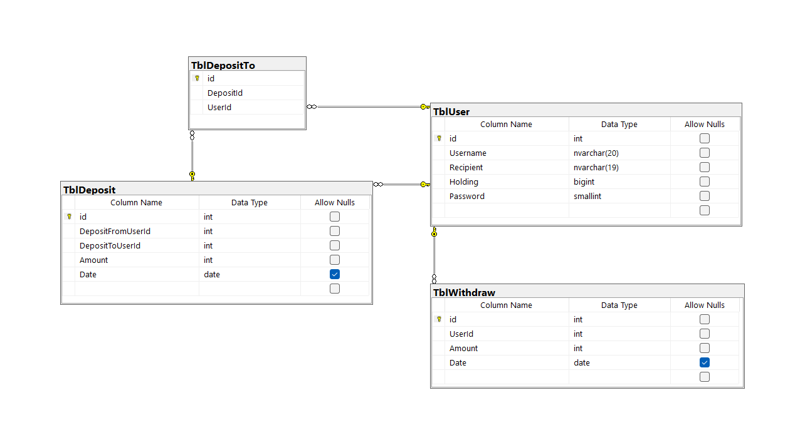

# ATM
ATM machine that i have build it in Windows Application c#.   
you can create an account with random recipient, you can deposit, withdraw, see your holding, withdraws and deposits.

I used imaginary relationship TblDeposit-DepositToUserId_TblUser-id in my codes and also I used a table called TblDepositTo and never used.   
I just wanted to show that there is two ways to do it and you can delete TblDepositTo or TblDeposit-DepositToUserId.
